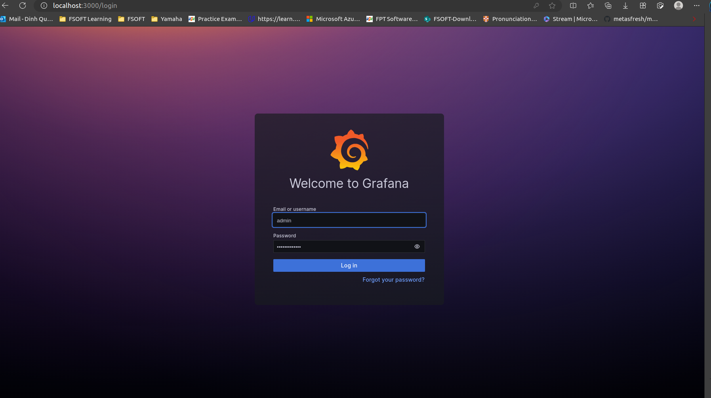

**Note:** For the screenshots, you can store all of your answer images in the `answer-img` directory.

## Verify the monitoring installation

*TODO:* run `kubectl` command to show the running pods and services for all components. Take a screenshot of the output and include it here to verify the installation


## Setup the Jaeger and Prometheus source
*TODO:* Expose Grafana to the internet and then setup Prometheus as a data source. Provide a screenshot of the home page after logging into Grafana.


## Create a Basic Dashboard
*TODO:* Create a dashboard in Grafana that shows Prometheus as a source. Take a screenshot and include it here.


## Describe SLO/SLI
*TODO:* Describe, in your own words, what the SLIs are, based on an SLO of *monthly uptime* and *request response time*.

### *Monthly Uptime SLO:* 
This could be expressed as a percentage, indicating the minimum acceptable uptime for the service within a month. For example, an SLO of 99.9% means that the service should be available and operational for at least 99.9% of the total time in a month.

### *Request Response Time SLO:* 
This could be expressed as a time duration, specifying the maximum acceptable time for the service to respond to a request. For example, an SLO of 200 milliseconds means that the service should respond to requests within 200 milliseconds on average.


## Creating SLI metrics.
*TODO:* It is important to know why we want to measure certain metrics for our customer. Describe in detail 5 metrics to measure these SLIs. 

### Uptime Percentage:
*Metric:* The percentage of time the service is operational within a month.

*Importance:* Uptime is a fundamental measure of service reliability. Customers rely on services being available when they need them. Monitoring uptime helps ensure that the service meets customer expectations for continuous availability, contributing to a positive user experience.

### Downtime Duration:
Metric: The total duration of downtime within a month.

*Importance:* Knowing not only the uptime percentage but also the actual duration of downtime provides insight into the impact of service disruptions. Minimizing downtime is critical for maintaining customer trust and preventing disruptions to their workflows.

### Error Rate:

*Metric:* The percentage of requests that result in errors.

*Importance:* Customers expect services to handle their requests without errors. Monitoring the error rate helps identify issues that might impact the reliability of the service. A low error rate is indicative of a stable and well-functioning system, contributing to a positive user experience.

### Response Time Distribution:

*Metric:* A breakdown of response times, including percentiles (e.g., 95th percentile response time).

*Importance:* While average response time is a common metric, understanding the distribution provides a more nuanced view. Tracking percentiles helps identify outliers and ensures that the majority of user requests are responded to within an acceptable timeframe. This is crucial for maintaining a responsive and efficient service.

### Incident Resolution Time:

*Metric:* The time taken to resolve incidents or outages.

*Importance:* In the event of service disruptions, customers are concerned with how quickly the issues are identified and resolved. Monitoring incident resolution time helps gauge the efficiency of the support and operations teams. Faster resolution times contribute to minimizing the impact on customers and improving overall satisfaction.


## Create a Dashboard to measure our SLIs
*TODO:* Create a dashboard to measure the uptime of the frontend and backend services We will also want to measure to measure 40x and 50x errors. Create a dashboard that show these values over a 24 hour period and take a screenshot.


## Tracing our Flask App
*TODO:*  We will create a Jaeger span to measure the processes on the backend. Once you fill in the span, provide a screenshot of it here. Also provide a (screenshot) sample Python file containing a trace and span code used to perform Jaeger traces on the backend service.

Code in here
https://github.com/kydq2022/udacity-CNAND-project3/blob/develop/Project_Starter_Files-Building_a_Metrics_Dashboard/reference-app/backend/app.py

## Jaeger in Dashboards
*TODO:* Now that the trace is running, let's add the metric to our current Grafana dashboard. Once this is completed, provide a screenshot of it here.


## Report Error
*TODO:* Using the template below, write a trouble ticket for the developers, to explain the errors that you are seeing (400, 500, latency) and to let them know the file that is causing the issue also include a screenshot of the tracer span to demonstrate how we can user a tracer to locate errors easily.

TROUBLE TICKET

Name: kydq2022

Date: 2023-12-06

Subject: Can not add star

Affected Area: Bacekend

Severity: Critical

Description:
```
kydq@LPP00078524D:~/udacity$ curl -X POST http://10.42.0.210:8080/star
<!doctype html>
<html lang=en>
<title>400 Bad Request</title>
<h1>Bad Request</h1>
<p>The browser (or proxy) sent a request that this server could not understand.</p>

```


## Creating SLIs and SLOs
*TODO:* We want to create an SLO guaranteeing that our application has a 99.95% uptime per month. Name four SLIs that you would use to measure the success of this SLO.
1. Availability SLI
2. Error Rate SLI
3. Latency SLI
4. Resource consumption


## Building KPIs for our plan
*TODO*: Now that we have our SLIs and SLOs, create a list of 2-3 KPIs to accurately measure these metrics as well as a description of why those KPIs were chosen. We will make a dashboard for this, but first write them down here.
1.  Resource consumption
```
CPU Usage

Memory Usage
```
2. Error Rate
```
The percentage of requests that result in server errors
```
3. Throughput 
```
The number of requests processed successfully per second
```
4. Latency
```
The average or 95th percentile response time of my application
```

## Final Dashboard
*TODO*: Create a Dashboard containing graphs that capture all the metrics of your KPIs and adequately representing your SLIs and SLOs. Include a screenshot of the dashboard here, and write a text description of what graphs are represented in the dashboard.  
